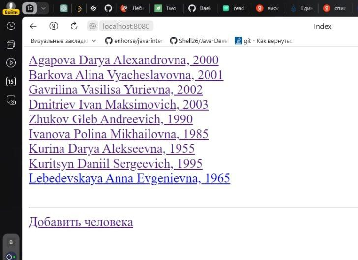
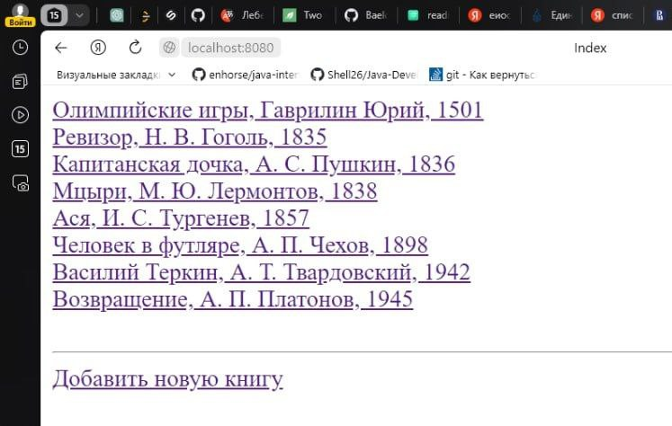
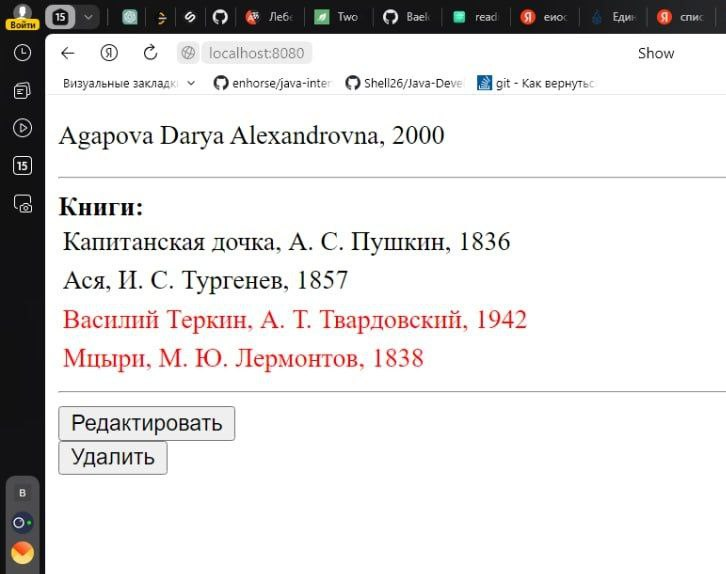
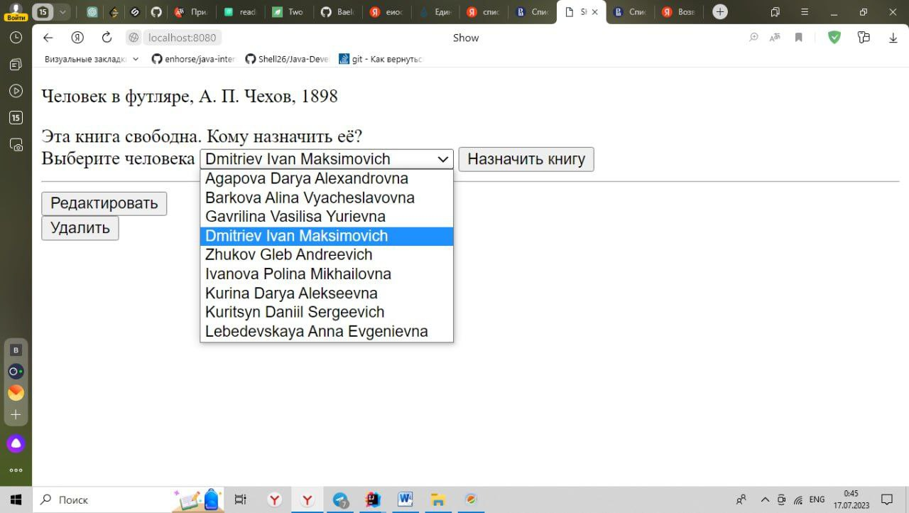
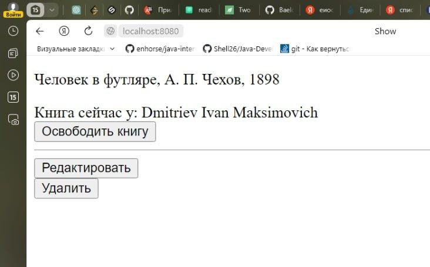
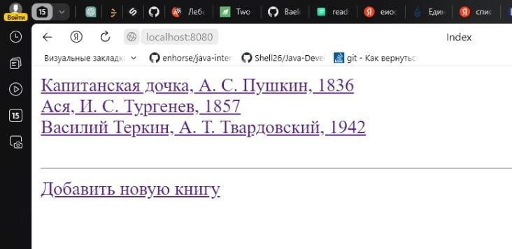
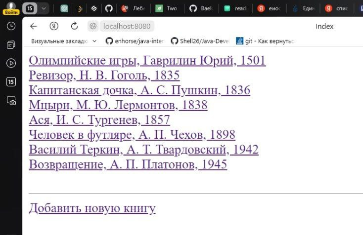
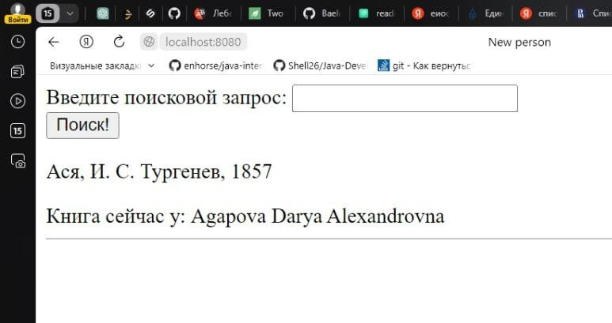

# Vera's Library2


This web application is designed for digital accounting of books in the local library. Librarians can register readers, give them books and release books after the reader returns to the library.


## Requirements


To run this application, you will need the following:

Java Development Kit (JDK) version 8 or higher
Apache Maven to build the project
Compatible database (for example, PostgreSQL)
## Installation

1. Clone the project repository to your local machine:

```bash
git clone https://github.com/VeraSlaveholder/Vera-s_Library2.git
```
2. Edit the 'application.properties' file to configure the connection to your database:

```bash
hibernate.connection.url=jdbc:postgresql://localhost:5432/your_database_name
hibernate.connection.username=your_username
hibernate.connection.password=your_password
```
3. Build a project using Apache Maven:

```bash
mvn clean package
```
4. Launch the app
5. Open a web browser and go to http://localhost:8080 to access the functionality of the application.
## Usage/Examples


The application provides the following functionality:

Page with a list of all readers: This page displays a list of all registered readers. Readers' names are clickable links that allow you to go to a specific reader's page.


All Books List Page: This page displays a list of all available books. Book titles are clickable links that allow you to go to the page of a specific book.


Reader's page: This page displays information about the selected reader, including his personal data and a list of books that he borrowed from the library. If the reader has not taken any books, the text "The person has not taken any books yet" is displayed instead of the list of books.


Book Page: This page displays information about the selected book, including its title and author, as well as the name of the reader who took this book. If the book was not taken by anyone, the text "This book is free" is displayed.


The "Release book" button: On the book page, if the book is taken by the reader, the "Release the book" button is displayed next to his name. The librarian can press this button when the reader returns the book to the library. After clicking, the book becomes available again and disappears from the reader's list of books.


Drop-down list and "Assign book" button: On the book page, if the book is available, a drop-down list with all readers and the "Assign book" button are displayed. The librarian can click on this button when the reader wants to take this book. After clicking, the book becomes taken by the selected reader and appears in his list of books.


Pagination for books: The application implements pagination for the list of books. There may be a lot of books, and they may not fit on one page in the browser. Librarians can scroll through the pages to view all available books.


Sorting books by year: Books are sorted by year of publication. The application provides the ability to view books in sorted order.


Book search page: On the book search page, the user can enter the initial letters of the book title in the search field and get the full title of the book, the name of the author and, if the book is currently in someone's possession, the name of that person.


Check for overdue return of a book: An automatic check for overdue return of a book has been introduced. If the reader has not returned the book on time, the system will automatically notify the librarian.


## Contributing

If you want to contribute to the development of this project, write to us at the email address bulgakova.vera2003@gmail.com to discuss the possibilities of cooperation and making changes to the project. We welcome bug reports, suggestions for improvements, and new ideas for app functionality.

Thank you for your interest in the project and your contribution to its development!
## Authors

- [@VeraSlaveholder](https://github.com/VeraSlaveholder)

